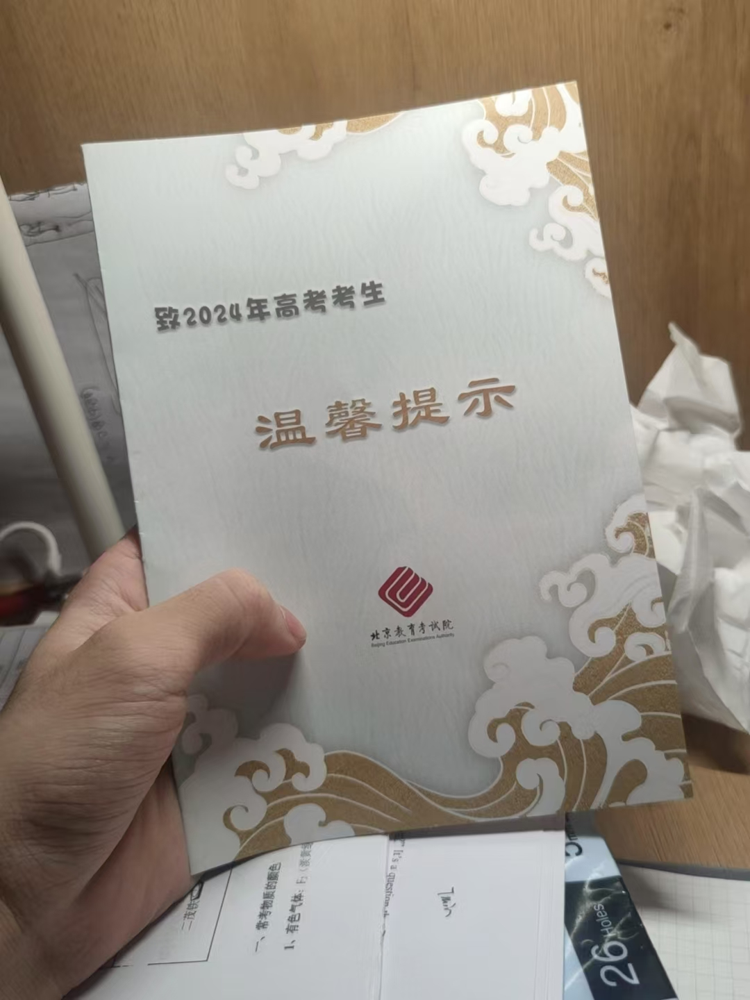
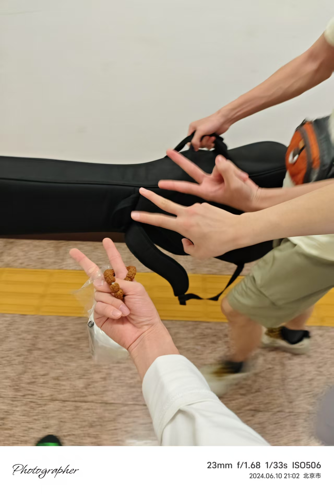

## 防喷设置

鄙人的文笔不是十分优秀，博客只是写给自己看的...

## 回忆
今天是2025年5月29号，翻开回忆角落，疲惫的生活...

打开自己的相册，看到了5月29号当天自己相册的内容
- 凌晨的我对着一根笔拍了一张照，照片中的笔芯用胶带裹上作为标记，其展示出了当时我一支笔狠狠学一天能用多少。高三那会的我确实很喜欢买各种各样的笔
- 晚上9：25,一张照片关于我们高中语文年级组汇编的高三语文试题本，封面被我很好的朋友用各种各样颜色的笔，大大小小写满了我的名字...就不放出来了，保护自己的隐私

其实现在的我已经想不起什么高中的很多事情了，能记起的只有回忆起来的美好瞬间和高三最后那段时间自己的努力。

庆幸的是，即使我考到了四川，我和曾经的好友，仍然保持着联系。

真要我说的话，谁又会没点遗憾呢... 走曲

<iframe frameborder="no" border="0" marginwidth="0" marginheight="0" width=330 height=86 src="//music.163.com/outchain/player?type=2&id=2144209098&auto=0&height=66"></iframe>

我写这篇的时候距离25年高考还有不到九天，这一年过的真的挺快的，我也适应了很多，成长了许多...

真要说考出北京有什么好处，我想可能是周围并没有那么多你熟悉的同学，或许对于我来讲，平常做事不必太束手束脚了。谁都不欠谁的。

没想到时间过的这么快，我马上都大二了...今日清理相册，指尖触到一张模糊的照片——是当年高考的准考证提示。想来是当时太过激动，镜头都不由得晃动。此刻再看，那股回忆竟压得我心口沉甸甸...

我的记忆瞬间被拉回：五六月的北京，天气很好。我们即将要面临高考，无心顾暇。我埋首于书山题海，只觉时间粘滞如蜜糖，缓慢得令人窒息。桌上那块橡皮，不知何时已被时光悄然啃噬，磨成了细碎的一小粒，散落如微茫的雪。那时心中焦灼翻腾，唯一的念头便是挣脱这千篇一律的煎熬，去远方，去瞧瞧大海的模样。

而当时间终于走完了刻度，24年6月11日的凌晨，我与两位挚友并肩站在渤海边。海风裹挟着咸腥扑面而来，我们静默着，看那轮红日磅礴跃出海平线，将天空与海水一同点燃。那一刻，才猛地惊觉：一切，真的结束了...

那段当时只道是寻常的朝暮，竟如此清晰地烙印在心底——那书页翻动的窸窣，笔尖摩擦的沙沙，连同那粒橡皮的碎屑，原来都是青春自身投下的浓重侧影，已沉沉地、永远地锚定在那里。

人生最是奇诡：曾日夜渴盼挣脱的樊笼，到头来竟成了灵魂归途最清晰的坐标；那些当时以为冗长无尽的煎熬，如今却化作心上最隽永的印痕——如同铅笔在纸面深深刻下的字迹，时光流转，反被岁月擦得愈发清晰、透亮...

加油2025年高考的同学，前程似锦，不留遗憾

---

拍摄于2024.6.6日12：59

拍摄于2024.6.10日晚21:02
>我们仨一拍脑门，高考完当天晚上就到了天津的滨海新区，准备第二天看日出

