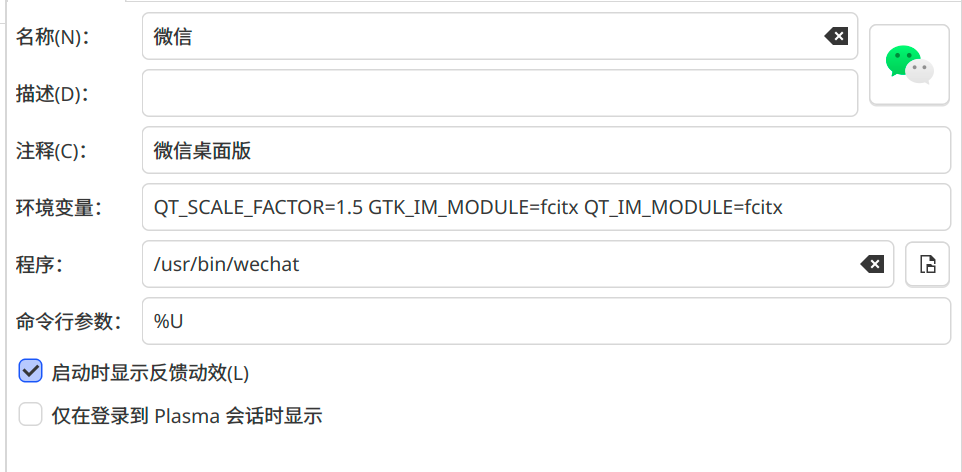

## 我的环境
我在用ArchLinux的时候没有遇到这个问题，但是今天突发奇想，想在Fedora42+KDE+Wayland上打游戏的时候，发现自己的微信无法正常调用fcitx5的中文输入法，故来这里记录分享一下自己的经验

废话不多说，直接上图！


添加环境变量：
```
QT_SCALE_FACTOR=1.5 GTK_IM_MODULE=fcitx QT_IM_MODULE=fcitx
```

第一个是缩放，因为楼主的电脑是HiDPI屏幕，所以需要缩放1.5倍。后两个就是配置fcitx5的工具，亲测可用！