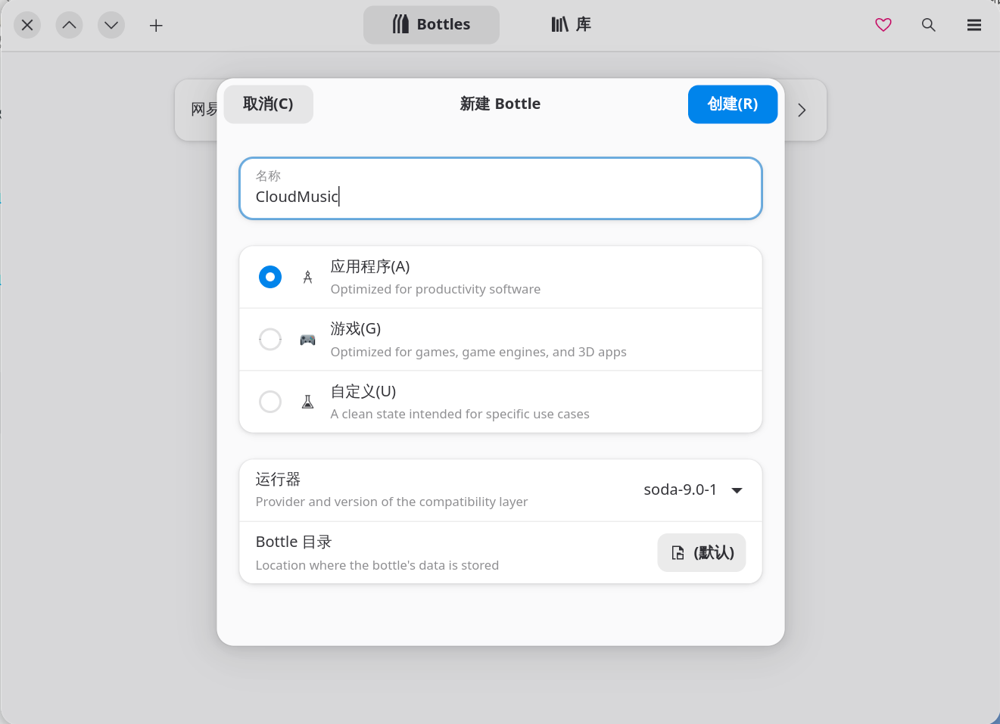
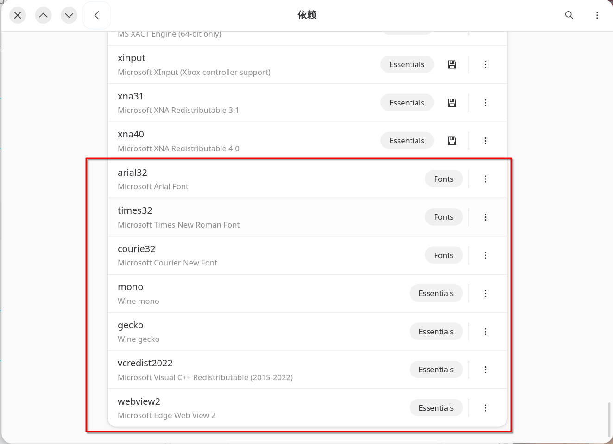
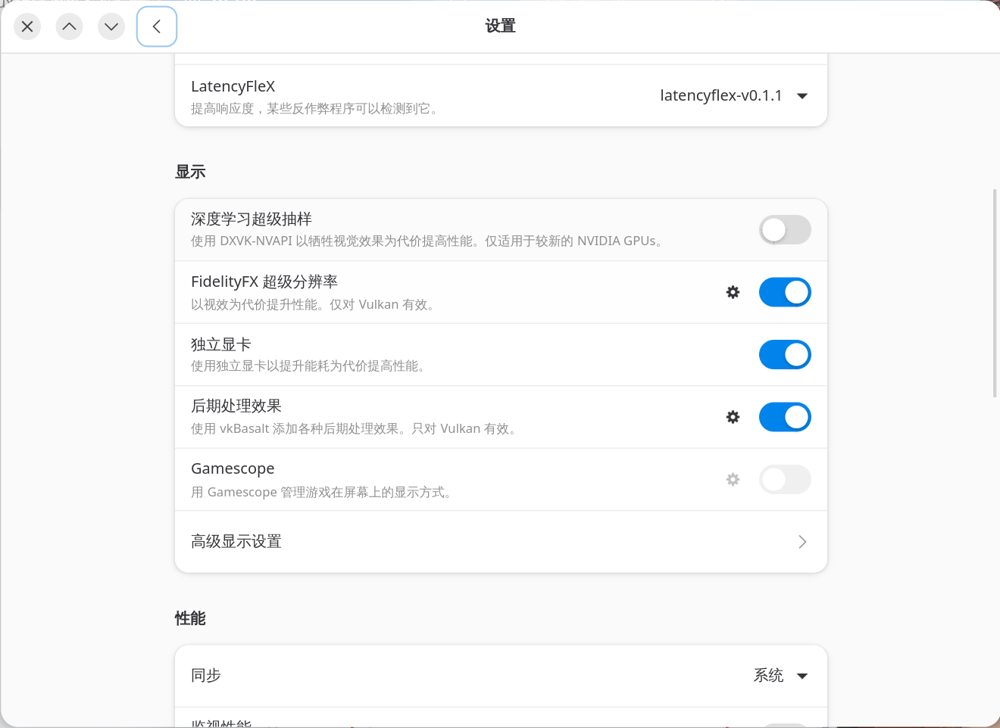
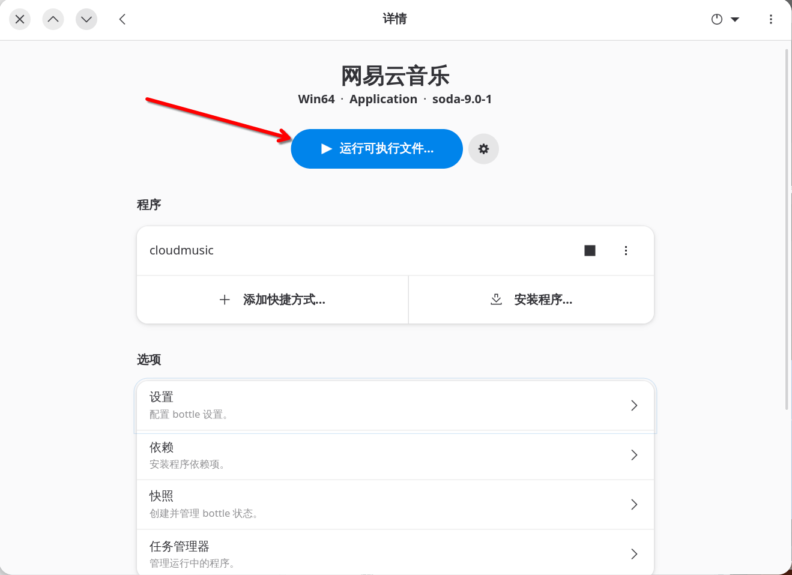
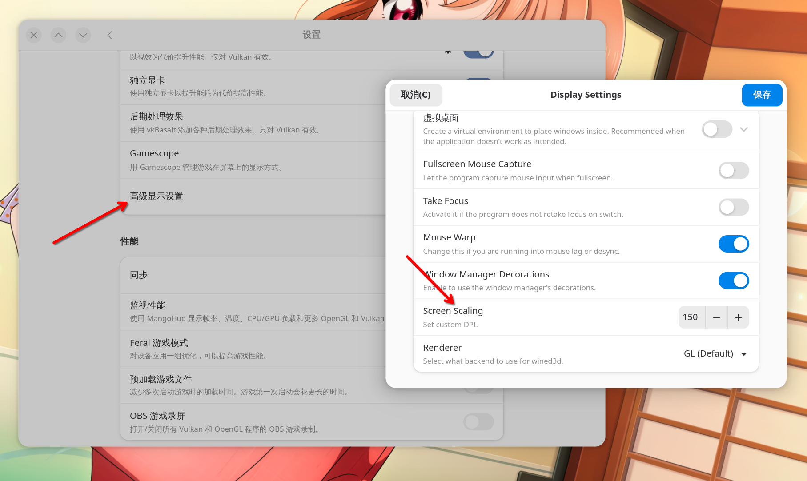

## 目前我所知晓的方法有几种

- 网页端网易云
- 用electron封装网页版
- 第三方客户端(如yesplayer,splayer等)
- 下载到本地用音乐播放器播放
- 用wine安装Windows版本

>这里网页端的使用方法就不多赘述了，直接点击 [网易云音乐](https://music.163.com/) 便可进入网页端

## 这里我们说说后几种方法

### 首先用electron封装

不要害怕，我其实有写过一篇帖子来介绍怎么使用一个工具名叫 `Nativerfier` 的封装工具

帖子如下： [Nativefier 使用教程](https://k7tmiz.com/posts/b56059f9.html)

我没有尝试过把网易云网页版封装成electron程序，我其实更推荐后几种方案...

### 第三方客户端

以Arch Linux为例 我推荐以下几个App(按顺序)：
	
1. Splayer 项目地址：[Splayer](https://github.com/imsyy/SPlayer)
	
	```
	yay -S splayer-git
	```
	
一款极其简约好用的音乐播放器，功能丰富操作简单直接，多系统可用，我就通过的AppImage来进行了安装，当然它也被收录到了AUR，我十分喜爱这款软件！

2. FeelUOwn 项目地址：[FeelUOwn](https://github.com/feeluown/FeelUOwn)
	
```
yay -S feeluown          # 安装稳定版，最新版的包名为 feeluown-git
yay -S feeluown-netease  # 按需安装其它扩展
yay -S feeluown-ytmusic
yay -S feeluown-bilibili
```


一个稳定、用户友好以及高度可定制的音乐播放器。基于文本的歌单，方便与朋友分享、设备之间同步。一键安装，各流行平台均有打包（如 Arch Linux, Windows, macOS 等）但是在我的Arch上使用，会出现网易云无法正常登录的情况，我不知道是个例还是什么情况...但是我仍然认为他的可拓展性很强，值得一个第二
	
3. YesPlayMusic 项目地址：[YesPlayMusic](https://github.com/qier222/YesPlayMusic)

```
yay -S yesplaymusic
```

高颜值的第三方网易云播放器，支持 Windows / macOS / Linux ，是我第一款开始使用的软件，问题是偶尔会掉线，然后颜值很高，很简约，但是作者似乎不咋打算更新新功能了，包会有点旧，介意的选前两个(我三个都要😋)
	
---

### 下载到本地然后用播放器不用过多赘述了

---
### 接下来用讲讲如何wine安装Windows版本的网易云

#### 优势：体验完美，功能齐全，不用担心掉号，不用担心被检测第三方等等，还有HiDPI支持

#### 劣势：配置麻烦，转译后可能会有一定的性能损耗
---
#### 效果如下：


KDE的系统托盘也能正常识别使用


#### 开始教学：

首先Arch的话通过AUR安装 `bottles` 这个包
```
yay -S bottles
```

安装好以后打开它，等加载一会

左上角➕号新建一个Bottle，名字随便写



然后去依赖的地方：


安装这些依赖：



去设置里边开符合自己电脑配置的选项：



点击运行可执行文件，选择[官网直链下载](https://music.163.com/#/download)下载下来的exe文件



安装后可以在下面直接打开,也可以添加快捷方式

效果如下：


#### HiDPI



ref： [网易云音乐最新版 Wine方案 （网易云Beta）](https://renil.cc/archives/47/)