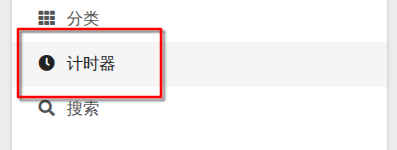
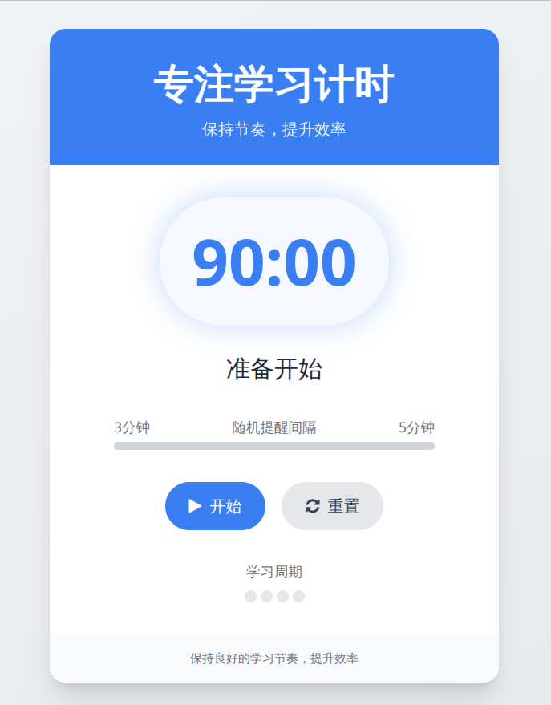

## 学习方法介绍

大概是90min学习后再休息20min，

在这90min中，设置一个在3-5分钟内就会响一声的闹钟

响一声后适当闭眼休息十秒

然后再继续学习，循环往复...

## 音频

由于音频文件太大，本座决定把bilibili视频直接搬过来...嘻嘻



## 主页也有计时器版本：

点进去以后：

弃用的原因很简单，因为浏览器会杀后台，所以计时不准确。不过如果一直保持前台，它是完全可用的！

ref： [「随机提示音」视频版（可以在后台播放）](https://www.bilibili.com/video/BV1X9Lmz1EEr/?spm_id_from=333.1007.top_right_bar_window_history.content.click&vd_source=858cf37c77b85a33717e40172534293a)