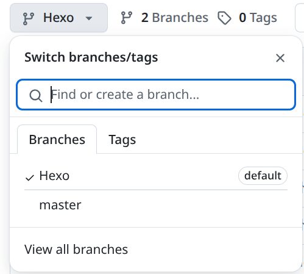
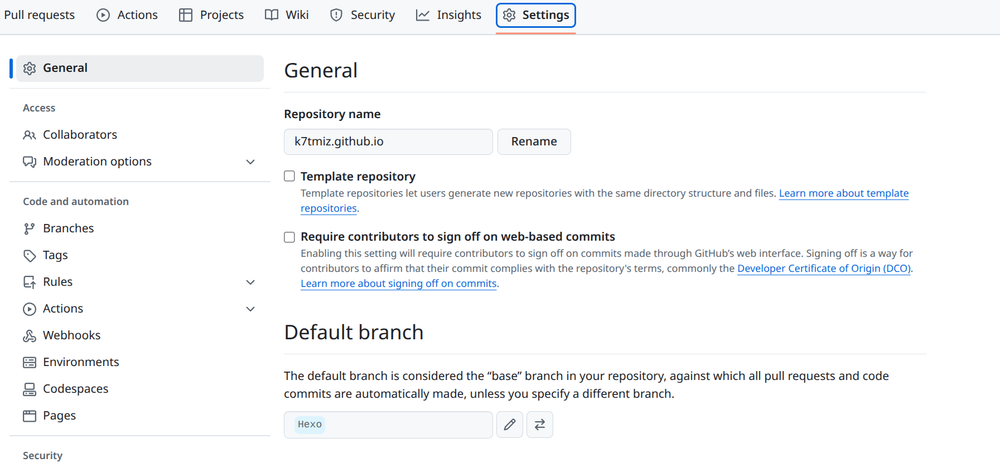
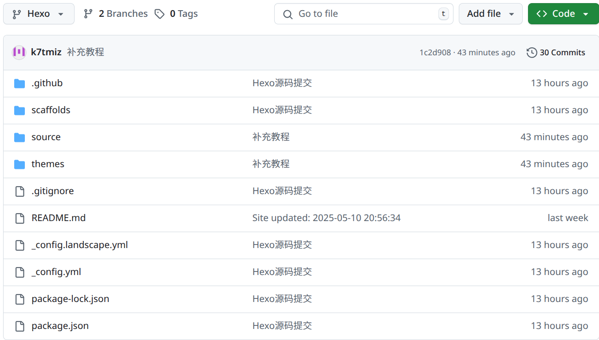

# 使用git分支保存Hexo源码到Github

引言：最开始想弄这个主要是因为我有多系统，多台设备，每次都要把整个文件夹进行压缩备份到U盘，效率低且不够优雅，偶然搜索到两篇帖子，助我解决了这一大难题，这里感谢[使用git分支保存hexo博客源码到github](https://zhuanlan.zhihu.com/p/71544809) 和 [hexo源码上传到GitHub](https://www.cnblogs.com/eidolonw/p/13066869.html) 这两篇帖子的编写者！

那么，教程开始

## 教程

### 1. 如图：



### 2. 然后将其设置成默认分支：



然后你这时候如果直接按照文章来的话，不行，大概率会**报错**...(问就是试过)
 
### 3. 初始化
```
git init #先初始化
```

### 4. **然后将本地Hexo目录与远程仓库关联**
```
git remote add origin https://github.com/k7tmiz/k7tmiz.github.io.git
```

### 5. 此时进入目录
`Ctrl+H` 显示所有文件。删掉 `.deploy_git` 文件夹，如果已经clone过主题文件，那么需要把theme主题文件夹里的 `.git` 也删除。因为git不能嵌套上传，最好是显示隐藏文件，检查一下有没有，否则上传的时候会出错，导致你的主题文件无法上传，这样你的配置在别的电脑上就无法正常使用了。**根目录中应该有个 `.gitignore` 文件**，如果没有，请自行创建并添加以下内容:
```
.DS_Store
Thumbs.db
db.json
*.log
node_modules/
public/
.deploy*/
_multiconfig.yml
```


### 6. 将clone并修改以后的文件夹推送到远程库
```
git add .
git commit –m "Description"
git push origin Hexo
```
此时已经成功将整个网站的源码全部推送到了远程库的默认分支Hexo中

### 7. 删除public等文件（可选）
因为source分支是从master分支新建的，初始代码实际就是master的拷贝，因而master中已有的public等deploy生成的文件也会一起带过来，这些都不算是博客源文件，如果你也觉着source分支还存着这些有些别扭，就可以先在本地把它删掉，然后执行：
```
git add .
git commit -m 'DEL: public things which only for deploy'
git push origin source
```
执行完之后，你的仓库大概就是长这个样子：



后续即便你再发布博客时，deploy生成public文件，在提交博客源码时，也不会将其带上去，因为有.gitignore将其忽略了。

### 8. 新环境
假设我们换电脑了，要在新环境继续在原有仓库基础上撸文章，此时通过 `git clone` 将博客源码拉到本地，然后安装、初始化Hexo就能搞定：
```
git clone https://github.com/k7tmiz/k7tmiz.github.io.git Blog
cd Blog
npm install -g hexo-cli
npm install hexo-deployer-git -save
npm install #安装所有依赖模块
```
