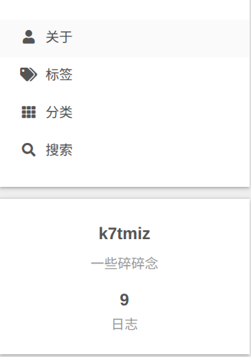

# Hexo和Github Pages

## 为什么选择Github Pages？
作为一个大学生，其实已经经过了很多尝试，我从初二开始接触Linux,接触服务器，反复搭过很多次自己的网站，但因为学业繁重，最后基本都不了了之...甚至最开始只会用服务器搭建，很多时候没有备份，忘记续费于是资料就全没了。而Github Pages的话，最大的优点就是完全免费！所以你有兴趣的话就继续看下去吧！

## 科普
1. Github Pages：
>GitHub Pages 是一项静态站点托管服务，它直接从 GitHub 上获取 HTML、CSS 和 JavaScript 文件，通过构建过程运行文件，然后发布网站。
你可以在 GitHub 的 github.io 域或自己的自定义域上托管站点。

可以总结为以下几点：
- Github Pages 是 Github 提供的网页寄存服务，用于存放静态网页，也就是我们的博客。
- 我们可以使用专业软件将文档转换成静态网页（如：Hexo），然后上传至 Github
- 最后的结果就像现在这样，你们可以通过我的github.io子域名访问到我生成的静态网页，即本篇博客

2. Hexo：
- Hexo 是一款基于 Node.js 的快速、简洁且高效的静态博客框架。
- Hexo 使用 Markdown（或其他渲染引擎）解析文章，安装十分方便，配置简单，自定义功能强大，在几秒内，即可利用靓丽的主题生成静态网页。
- 使用起来的效果就是：我仍然可以使用 Markdown 写博客内容，然后使用部署在本地的Hexo框架进行解析，生成相应的静态网页，最后一键上传即可。

# 教程开始：
## Step1: 创建 github 账号和`username`.github.io 仓库

## Step2: 在本地部署环境(Linux)

- 安装: 
```
sudo pacman -S git npm nodejs
```

- 部署Hexo: 
```
npm install -g hexo-cli
```
- 初始化 Hexo 框架: 
```
hexo init Blog
```
- 进入 Blog 文件夹: 
```
cd Blog
```
- 安装依赖: 
```
npm install
```
- 启动 Hexo 服务: 
```
hexo s
```

## Step3: 配置 Next 主题

- Github拉取Next主题: 
```
git clone https://github.com/iissnan/hexo-theme-next themes/next
```
- 在根目录的 `_config.yml` 文件中修改 `theme: next`

## Step4: 添加博客内容

- 将写好的 Markdown 放到 `source\_posts` 目录
- 将相应的图片放到 `source\images` 目录
- 启动 Hexo 服务
## Step5: Next主题美化

### **选择Scheme**
编辑主题配置文件 `themes\next_config.yml` ，确定喜爱的Scheme，我选择了Gemini
```
# Schemes
scheme: Gemini
#scheme: Mist
#scheme: Pisces
#scheme: Gemini
```

### 侧边栏显示当前浏览进度
打开 `themes/next/_config.yml` ，搜索关键字 `scrollpercent` ,把 false 改为 true
>如果想把 top 按钮放在侧边栏，搜索关键字sidebar ,把 false 改为 true

### 隐藏网页底部powered By Hexo / 强力驱动
打开 `themes/next/layout/_partials/footer.swig` ,使用注释隐藏之间的代码即可，或者直接删除。位置如下：
```
<!--

  <div class="powered-by">
    
    
      
    
    {{- __('footer.powered', next_url('https://hexo.io', 'Hexo', {class: 'theme-link'}) + ' & ' + next_url(next_site, 'NexT.' + theme.scheme, {class: 'theme-link'})) }}
  </div>

-->
```

### 设定菜单内容

编辑主题配置文件 `themes\next_config.yml`
```
menu:
  #home: / || fa fa-home
  about: /about/ || fa fa-user
  tags: /tags/ || fa fa-tags
  categories: /categories/ || fa fa-th
  #archives: /archives/ || fa fa-archive
  #schedule: /schedule/ || fa fa-calendar
  #sitemap: /sitemap.xml || fa fa-sitemap
  #commonweal: /404/ || fa fa-heartbeat
```

>按照上面的方式设置的菜单之后，点击标签，或者关于我都会出现错误页面，那这是怎么回事呢？
在默认情况，source 目录只有 _posts 一个文件夹的，并没有生成对应的 tags,about 等文件夹

生成下菜单文件夹的可以了: ```hexo new page tags```

### 搜索功能

```
npm install hexo-generator-search --安装插件，用于生成博客索引数据
```

修改博客配置文件（根目录/_config.yml），添加以下代码
```
search:
  path: search.json
  field: post
  format: html
  limit: 1000
```

### 文章自动折叠功能

```
npm install hexo-excerpt --save
```

修改博客配置文件（根目录/_config.yml），添加以下代码
```
excerpt:
  depth: 10
  excerpt_excludes: []
  more_excludes: []
  hideWholePostExcerpts: true
```

[Hexo-Excerpt](https://github.com/chekun/hexo-excerpt)

### 利用Hexo-abbrlink插件生成唯一文章链接

Hexo在生成博客文章链接时，默认是按照年、月、日、标题格式来生成的，可以在站点配置文件中指定new_post_name的值。默认是:year/:month/:day/:title这样的格式。如果你的标题是中文的话，你的URL链接就会包含中文。复制后的url路径就是把中文变成了一大堆字符串编码，如果你在其它地方用了你自己这篇文章的url链接，偶然你又修改了该文章的标题，那这个url链接岂不是失效了。
为了给每一篇文章来上一个属于自己的链接，可以利用hexo-abbrlink插件，来解决这个问题。

首先安装下hexo-abbrlink
```
npm install hexo-abbrlink --save
```

修改博客配置文件（根目录/_config.yml），添加以下代码
```
permalink: post/:abbrlink.html
abbrlink:
  alg: crc32  # 算法：crc16(default) and crc32
  rep: hex    # 进制：dec(default) and hex
```

### 日志的自动分类插件

```
npm install hexo-auto-category --save
```

修改博客配置文件（根目录/_config.yml），添加以下代码
```
auto_category:
 enable: true
 depth:
```

### Hexo插入图片并解决图片的路径问题

ref: [Hexo插入图片并解决图片的路径问题](https://www.hwpo.top/posts/d87f7e0c/index.html)

```
npm install hexo-renderer-marked --save
```

修改博客配置文件（根目录/_config.yml），修改添加以下代码
```
post_asset_folder: true
relative_link: false
marked:
  prependRoot: true
  postAsset: true
```

- post_asset_folder: true
> 执行hexo new post xxx时，会同时生成./source/_posts/xxx.md文件和./source/_posts/xxx目录，可以将该文章相关联的资源放置在该资源目录中。
- relative_link: false
> 不要将链接改为与根目录的相对地址。此为默认配置。
- prependRoot: true
> 将文章根路径添加到文章内的链接之前。此为默认配置。
- postAsset: true
> 在post_asset_folder设置为true的情况下，在根据prependRoot的设置在所有链接开头添加文章根路径之前，先将文章内资源的路径解析为相对于资源目录的路径。

举例说明：
执行hexo new post demo后，在demo文章的资源路径下存放了a.jpg和cover.jpg（用作封面），目录组织结构如下：
```
./source/_posts
├── demo.md
└── demo
    ├── a.jpg
    └── cover.jpg
```

在demo.md的适当位置引用这两张图片，指定图片相对路径时需要假设当前目录为./source/_posts/demo/，而不是demo.md文件本身的所在目录。

图片语法:
``

Github仓库: [hexo-renderer-marked](https://github.com/hexojs/hexo-renderer-marked)

### 一键回顶部

修改Next配置文件（theme/next/_config.yml），修改以下代码
```
back2top:
  enable: true
  # Back to top in sidebar.
  sidebar: false
  # Scroll percent label in b2t button.
  scrollpercent: true
```

### 阅读进度条

修改Next配置文件（theme/next/_config.yml），修改以下代码
```
reading_progress:
  enable: true
  # Available values: top | bottom
  position: top
  color: "#37c6c0"
  height: 3px
```

### 定制Next主题的Sidebar_state
因为只有true和false 而我想定制在Hexo的NexT主题中仅显示侧边栏的archive部分并隐藏tags

修改Next配置文件 `theme/next/layout/_partials/sidebar/site-overview.swig` ，注释你想注释掉的，比如我注释掉了 `categories` 和 `tags` 



## Step6: 将生成的静态页面部署到 Github 上
- 具体操作：修改站点配置文件_config.yml的最后部分
```
deploy:
  type: git
  repo: https://github.com/k7tmiz/k7tmiz.github.io.git
  branch: master
```
**要先安装deploy-git，才能用命令部署到GitHub**
```
npm install hexo-deployer-git --save
```

然后
```
hexo clean #清除之前生成的东西
hexo generate  #生成静态文章，缩写hexo g
hexo deploy  #部署文章，缩写hexo d
```

过一会儿就可以在 `yourname.github.io` 这个网站看到你的博客了

暂时也想不太起来还改了哪些内容，等想起来或者有扩充我再接着完善文档好吧

> 还有使用Git分支保存Hexo博客源码到Github有空再更... 2025.5.19日凌晨0:45分先立下Flag(doge)

## 其他参考的一些帖子

ref: [2024年，如何使用 github pages + Hexo + Next 搭建个人博客](https://mini-pi.github.io/2024/02/28/how-to-make-blog-wedsite/)
ref: [NexT主题美化](https://losophy.github.io/post/71afd747.html)
ref: [Hexo博客优化之Next主题美化](https://huangpiao.tech/2019/01/24/Hexo%E5%8D%9A%E5%AE%A2%E4%BC%98%E5%8C%96%E4%B9%8BNext%E4%B8%BB%E9%A2%98%E7%BE%8E%E5%8C%96/)
