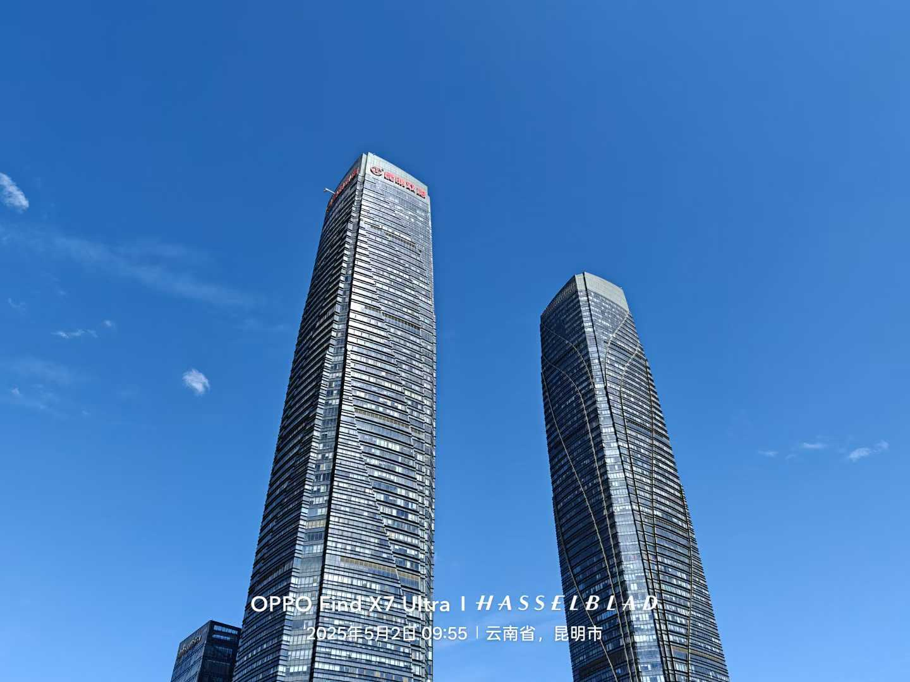
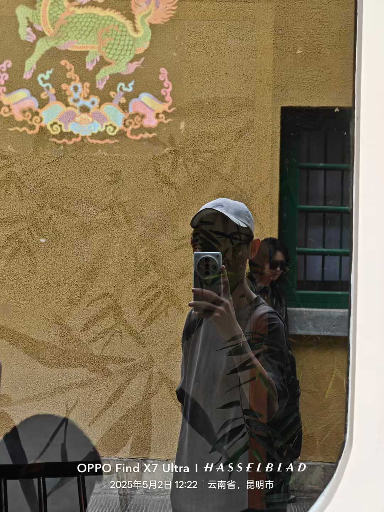
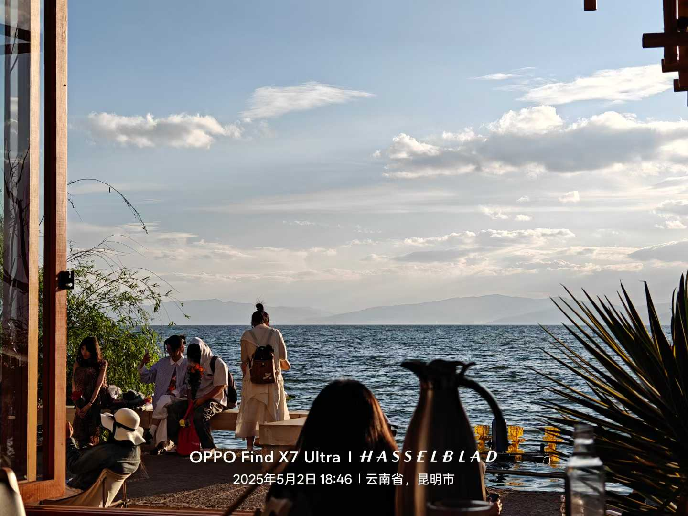
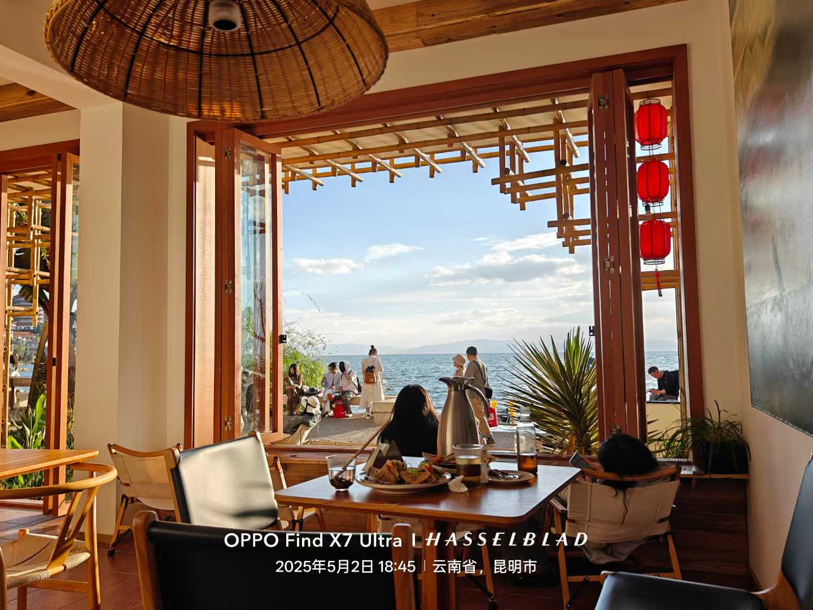
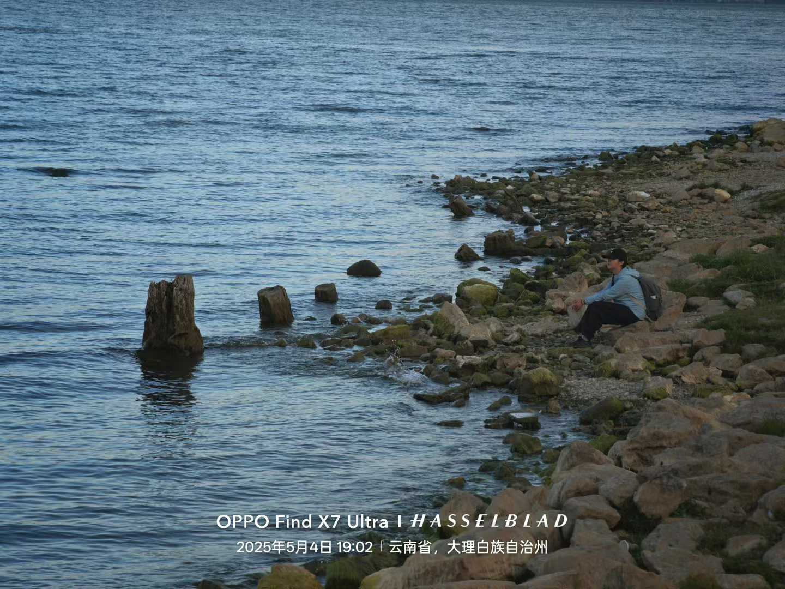
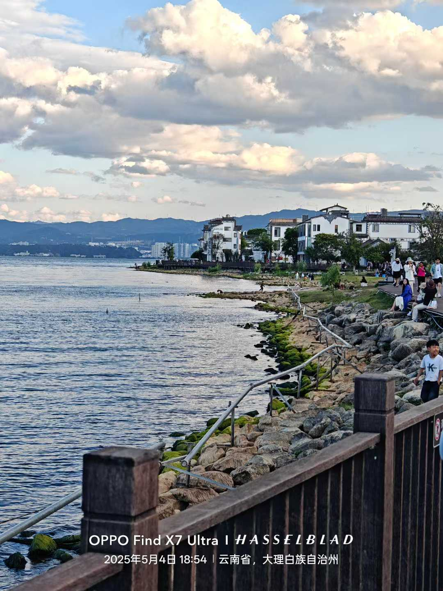
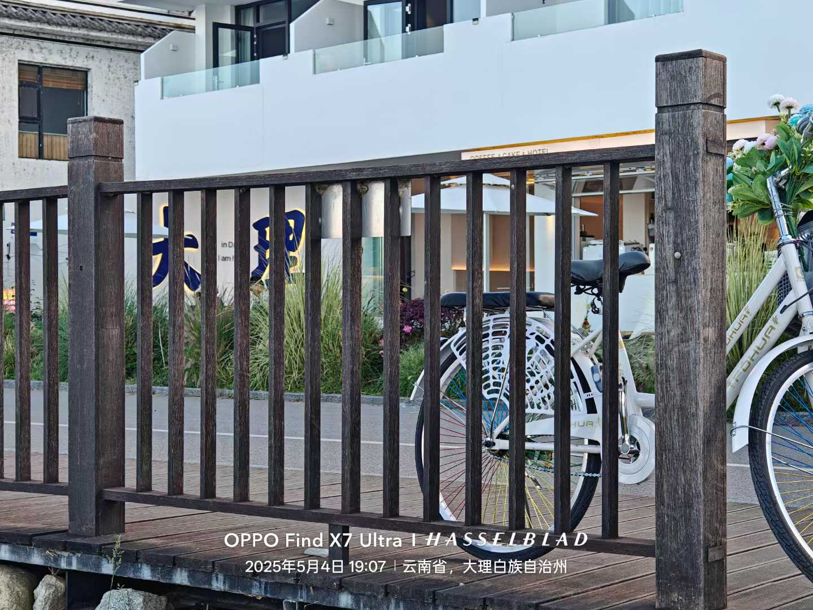

# 云南旅游攻略

# 昆明部分
## **昆明部分是自己做的 大理大部分是购买的，秉承着Opensource的原则全部分享出来**
> 其实还有好多好多照片都发到朋友圈去了 这些图片都是随便节选的...当然也是从朋友圈下载下来的 因为压缩，体积图片比较小嘻嘻

#### 昆明双塔

- 滇池
- 翠湖
- 昆明老街
- 西山索道(100)
- 斗南花市
- 陆军讲武堂

### Day1 5月2日

昆明站－昆明老街(东方书店－纸片楼－对月楼酒店)－(非正常咖啡馆 选去 打卡点)－黄公东街－翠湖公园－陆军讲武堂－西山索道－海洪湿地公园(滇池)－捞鱼河湿地公园(滇池)－斗南花市－南强集市

> 视情况加入云南师大(主要是不好进去 管的严)

> 最后还是没进去 from 25.5.10
#### 忘了在哪拍的了...

#### 后几张都是昆明的滇池

### Day2 5月3日

有可能去海埂大坝看一眼日出

十点高铁－大理

# 大理

- 洱海
- 苍山(30)
- S弯
- 理想邦
- 大理古城
- 喜洲古镇
- 沙溪古镇
- 双廊古镇
- 南诏风情岛
- 崇圣寺三塔

### Day2 5月3号大理行－下午

大理站－磻溪村（S湾）-喜洲古镇（扎染+稻田）-大理古城
> 下午打车前往磻溪村，租个自行车游览网红S湾生态廊道（游览时间2.5小时）（定位马久邑或磻溪村）
洱海生态廊道全程差不多有50公里，精华地段就是马久邑附近和磻溪村附近，很多比较火的视频和图片都是这两段。
线路大概为：马久邑-富美邑-下波淜-磻溪村-古生村，沿途有很多咖啡厅，玩累了可以进去坐坐，享受一下洱海边的风景。
美食推荐：磻溪村附近（信达小吃，望海人家），马久邑附近(二两小吃店白族庭院私房菜，原生态白族农家菜），古生村（村里大青树附近有很多本地特色小吃）
之后骑行抵达喜洲古镇，游览线路大致为：
第一站：大理路边野餐咖啡画廊
第二站：我在洱海有块田！ 
超级大的拍照基地，麦田很大，人也没有喜洲古镇里的多！有很多出片的机位，有火车，有秋千都很好看！
第三站：白族扎染  推荐“喜蓝扎染”，做衣服。 
扎染的步骤是先选定你做的款式，再和老板商量确认设计想法和实现步骤。店员会先辅助你完成手工部分后，进行1泡水/去碘伏2染色3 冲洗4 氧化5 皂洗6 清洗7 晒干，整个过程根据你选择的产品难易程度决定，体验大概在30分钟到一小时。就可以获得一件亲自设计扎染的艺术品啦
喜洲还有非遗--瓦猫，各种类型的寓意都有，可以挑一个
喜洲美食推荐:喜洲粑粑(一定要尝尝，当地特色)，四方街食店，口未江湖，喜洲老冰棍，喜酒坊小吃店
吃完后夜游大理古城
游览路线指南:床单艺术厂-五华楼（出片，缺点人多）-红龙井-关帝庙-文殊庙-天主教堂-玉洱园 -洋人街-电影博物馆-基督教堂

**住宿**：大理古城

#### 洱海

### Day3 5月4号

龙龛码头-云想山（路极公园）-理想邦--文笔村日落
> 早上第一站龙龛码头（游览时间2小时）， 大理最美码头之一，还有水中红杉树拍照很美。
如果想体验洱海日出，就需要早一点，日出时间：早上7:30-8:00左右，可以稍微提前一点去占位置，享受等待日出的过程。
位置导航：直接导航阳光便利店，距离海边大概只有200米
之后电动车前往云想山-路极公园---亚洲第二国内唯一的路极（游览时间2.5小时）
无想，无限的放空，任凭暮霭一点一点席卷天边，大理城的万家灯火星星点点，陆续绽放。沉溺在这无边的夜色之中。
悬崖礼堂  白色的三角礼堂在蓝天与洱海的背景下特别唯美，还能看到远处的风车山
咖啡店  一楼有个有着大大落地窗，很好拍，二楼是2188落日餐厅，价格有点贵，味道也一般般，三楼是天台，有一个镜面地板，白天可以拍自己的倒影，晚上看夜景一览无余
山顶草坪 在咖啡馆旁边的草坡上，草坪不大，结合天空的云朵可以拍出很好玩的照片
路极  是来自新西兰的无动力车，自己可以控制速度沿着山道开
路极门票：大人188元3次  分叉口选右边是缓长的道，左边道更刺激好玩
开到山脚可以坐缆车或者电瓶车上山顶
下午前往圣托里尼·理想邦（游览时间1小时）
推荐打卡：理想的花园！它藏在圣托里尼岛里，浪漫氛围拉满
拍照点：小木屋、天空之镜、秋千、仙人掌、花门、大片的绣球花和小雏菊
门票：135元/2人，单人票是68元/人
美食推荐：烟云融合菜餐厅·川滇菜、天边的云Sky Cloud 海景餐厅
最后前往文笔村，抵达前往海之礼堂，感受那里的壮丽海景。晚上，在海之礼堂边的悬崖餐厅品尝美食，欣赏美丽的日落。
打卡彩虹公路，这里有种日本镰仓的感觉。无论是漫步还是骑行，都能让你放松心情。午餐时间，推荐到推荐餐厅：青寂日落海景餐厅  六阅海东方悬崖海景餐厅
备选体验景点：罗荃半岛旁的理记咖啡（游览时间1小时）
刘亦菲同款【理记先生】，是一辆超长的绿皮车，摊主推荐了“老板的一生”和“苍山梅烦恼”
老板的一生：是一款生椰dirty，有苦有甜，感觉比之前用冰博客做的更好喝些。
苍山梅烦恼：梅子味的冰美式，带点酸，果酸和咖啡的酸融合在一起，不会太酸也尝不到偏甜的糖浆味

#### 洱海

### Day4 5月5号 回昆明

苍山索道（感通）-大理站
>打车前往感通索道，苍山景点最集中的一条索道，全长2630米，全程25分钟，乘坐该缆车，可仰望苍山雪峰俯瞰百里洱海大理古城。沿途有珍珑棋局清碧溪苍山大峡谷玉带云游路，除索道外，还有千年古刹感通寺、“最美尼姑庵”寂照庵。
感通索道详细攻略
门票价格：全程窗口115，网络110，
游玩线路：感通全程索道往返，约2.5小时
1检票后乘索道至上站
2到上站后游玩珍珑棋局、玉带路、苍山大峡谷、清碧溪
3从感通索道下山
4下山后游玩感通寺、寂照庵（可在庵内吃斋饭）

# 大理伴手礼
> 大理伴手礼推荐：白族扎染  瓦猫  白族甲马  剑川木雕  白族羊毛毡 鹤庆银器 下关沱茶 雕梅酒 洱宝话梅 乳扇 鲜花饼  鹤庆米糕  
大理古城北门菜市场平等路上山货特产批发：普洱茶、果酒、野生菌、蜂蜜  小粒咖啡都不错
大理古城土特产最多，都可以适当讲价。先尝后买。
下关火车站旁边的有点贵。

